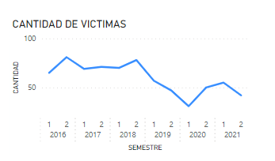
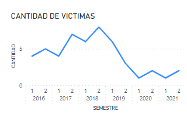
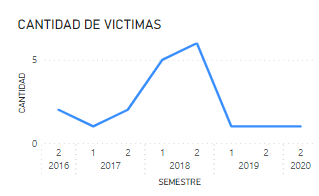
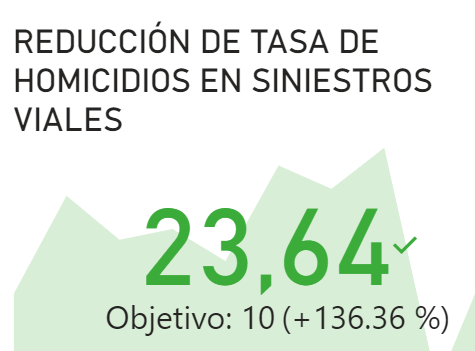
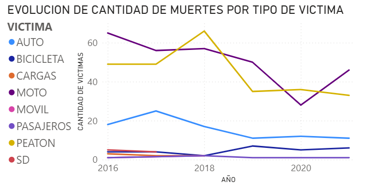
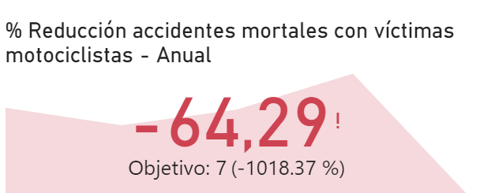
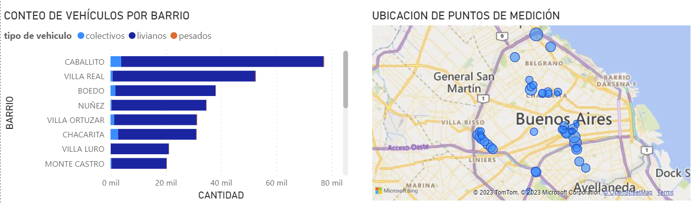
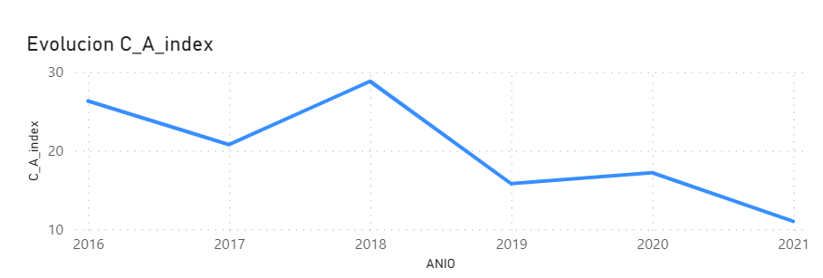
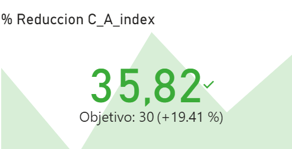

# Análisis de siniestros viales con víctimas fatales en CABA

La cantidad de muertes causadas por accidentes de tránsito en Argentina es un asunto de gran interés que requiere un esfuerzo continuo para su mejora. Expertos en seguridad vial señalan que en Argentina, la probabilidad de que una persona pierda la vida en un accidente de tráfico es dos o incluso tres veces mayor que en un incidente de inseguridad delictiva. Esta estadística subraya la importancia de abordar de manera efectiva la seguridad vial y asignar recursos de manera adecuada para reducir los siniestros viales.

Para tomar decisiones efectivas en este campo, es fundamental contar con un sólido análisis de datos. El acceso y la interpretación de información precisa sobre los siniestros viales y sus causas son elementos esenciales para diseñar estrategias y políticas de seguridad vial efectivas que puedan contribuir a la reducción de estos incidentes.

En este contexto, mi labor se centró en la elaboración de un proyecto de anális de datos, con el fin de generar información que le permita a las autoridades locales tomar medidas para disminuir la cantidad de víctimas fatales de los siniestros viales en CABA. 

### 1.	Fuente de Datos:
***
Datos públicos generados, guardados y publicados por el Gobierno de la Ciudad de Buenos Aires.  

> Dataset principal: 
- Archivo ‘Homicidios (XLSX)’:
Información sobre Homicidios y Lesiones en siniestros viales ocurridos en la Ciudad.
:point_right: [link](Notebooks/https://data.buenosaires.gob.ar/dataset/victimas-siniestros-viales) 
>Datasets complementarios: 
-	Conteo Vehicular.csv: 
Información de conteo sobre el paso de vehículos en diferentes cruces de calles de la Ciudad.
:point_right: [link](Notebooks/https://data.buenosaires.gob.ar/dataset/conteo-vehicular) 
- Barrios.csv:
Límites y ubicación geográfica de los barrios de la Ciudad.
:point_right: [link](https://data.buenosaires.gob.ar/dataset/barrios)
***

### 2.	Analisis exploratorio de datos:
 
 
 
 
 
  
EDA:point_right: [link](EDA/EDA_T2_final.ipynb) 
Los datos de homicidios viales tenían una buena calidad, no presentaban valores duplicados ni nulos. Contenían una categoría SD para los registros ‘sin dato’, los cuales representaban una proporción muy baja respecto a la totalidad de datos. En algunos casos se pudieron corregir valores utilizando la información de datos de otras columnas.
Se eliminaron del conjunto de datos las columnas que no aportaban valor al análisis, ya sea por presentar pocos valores o información redundante. 
Se utilizó el dataset barrios.csv para poder asignarle el barrio a cada dirección de accidente y poder trabajar a nivel un poco más detallado que la comuna.
El análisis de las variables categóricas se realizó a partir de gráficos de frecuencia, pudiendo encontrarse las siguientes relaciones:
  * En las avenidas ocurren la mayor cantidad de accidentes fatales.
  * El barrio Flores presenta una cantidad de accidentes fatales superior al resto de los barrios de CABA.
  * Las principales víctimas son los motociclistas, seguido por los peatones.
  * Los principales acusados son los autos,  seguidos por los  vehículos de transporte de pasajeros(colectivos) y luego transporte de cargas.
  * Hay  una tendencia a la baja de accidentes fatales con los años.
  * El mes de diciembre presenta la mayor cantidad de accidentes fatales.
  * El rol de las victimas predominante es el de conductor seguido por peatón.
  * El sexo masculino prevalece sobre el femenino en las vitimas fatales.

### 3. Proyecto de análisis de datos

***
#### PARTE 1:
***
Esta sección cuenta con información de tendencia de homicidios en el tiempo, ubicación de homicidios, tipo de calle, día de la semana y rango horario de los homicidios y el seguimiento del siguiente KPI:

**Reducción en un 10% la tasa de homicidios en siniestros viales de los últimos seis meses, en CABA, en comparación con la tasa de homicidios en siniestros viales del semestre anterior**

*Nota: Definimos a la tasa de homicidios en siniestros viales como el número de víctimas fatales en accidentes de tránsito por cada 100,000 habitantes en un área geográfica durante un período de tiempo específico. Su fórmula es: (Número de homicidios en siniestros viales / Población total) * 100,000*

En el gráfico de homicidios por semestre, se observa una tendencia de reducción de accidentes desde el 2016 al 2021. Es importante mencionar que durante el periodo estudiado, durante 2020 ocurrió la pandemia por COVID. Durante ese año, bajó fuertemente la circulación de personas en la ciudad, tanto peatones como motorizadas. Luego en 2021, la situación no vuelve a ser la misma que pre_pandemia ya que se instala el hábito del trabajo home-office. 

El barrio de Flores presentó la mayor cantidad de accidentes ocurridos en los últimos 3 años, seguido por los barrios de Palermo, Balvanera y Belgrano.
En Flores y Palermo el porcentaje de ocurrencia de estos accidentes en avenidas es superior al 95%. En cambio, este porcentaje disminuye a un 50% para los barrios de Balvanera y Belgrano. 
Con respecto al horario de ocurrencia de accidentes, se observa que entre las 7 a 9 hs ocurren más accidentes que en el resto de los horarios, lo cual puede estar asociado a que se trata de una hora pico de circulación.

Un punto a tener en cuenta es que si bien el barrio Flores posee la mayor cantidad de accidentes en el periodo estudiado, también muestra un fuerte decrecimiento de los mismos a partir del segundo trimestre del año 2018.  Analizando particularmente a las victimas peatones, se puede notar que Flores pasó de ser el barrio con mayor cantidad de homicidios de peatones en los años de 2016, 2017 y 2018 a no tener víctimas peatones en 2021. Esta tendencia es previa a la pandemia. Por lo tanto es recomendable estudiar las medidas que se tomaron en dicho barrio y replicarlas en otras zonas. 
- Cantidad de victimas en barrio Flores 
 
- Cantidad de victimas peatones en barrio Flores  

El KPI de reducción de tasa de accidentes viales semestral es ampliamente superado. El KPI objetivo es de un 10% de reducción y se tiene un valor de 23,64%.
 

 
  

***
#### PARTE 2: 
***

Esta sección cuenta con información de  gráficos de evolución de cantidad de muertes discriminado por tipo de víctima (moto, peatón, etc).  También se muestra el tipo de vehículo acusado en el siniestro. Finalmente, se complementa el análisis con información de las víctimas tal como el sexo y el rango etario. 
 
Se reliza el seguimiento del indicador de rendimiento clave, KPI definido como : 
**Reducción de  un 7%  de la cantidad de accidentes mortales de motociclistas en el último año, en CABA, respecto al año anterior** 
 
*Nota: Definimos a la cantidad de accidentes mortales de motociclistas en siniestros viales como el número absoluto de accidentes fatales en los que estuvieron involucradas víctimas que viajaban en moto en un determinado periodo temporal. Su fórmula para medir la evolución de los accidentes mortales con víctimas en moto es: (Número de accidentes mortales con víctimas en moto en el año anterior - Número de accidentes mortales con víctimas en moto en el año actual) / (Número de accidentes mortales con víctimas en moto en el año anterior) * 100*  
 
Las principales víctimas fatales de accidentes de tránsito son los peatones y  motociclistas. En tercer puesto se encuentran los autos. Se observa que esta relación se mantuvo en todo el periodo estudiado.
 

 
  
 
Al analizar cada categoría por separado puede observarse que hay una tendencia a la baja de homicidios para todas las categorías de víctimas, pero es más marcada en los peatones.  
En el caso de las victimas motociclistas, la tendencia general es de baja en el período 2016-2021. Sin embargo, en el último año hubo una tendencia de alza. Este comportamiento puede verse reflejado en el no cumplimiento del KPI, el cual muestra que hubo un incremento relativo de un 64,29% de victimas de moto en 2021 respecto al año 2020.  

 
  

Esto es esperable ya que  la cantidad de víctimas en 2020 se vio afectada por la disminución abrupta de circulación en las calles por motivo de la pandemia.
Teniendo en cuenta todo el período de datos analizado, se observa que predominan las victimas de sexo masculino, representando un 87% de total de víctimas.  

Este porcentaje se ve reducido para las victimas peatones que posee un porcentaje más equilibrado entre sexos del 61%.  Esto puede tener origen en que la proporción de hombres circulando en autos y motos podria ser superior a la de mujeres o en el patrón de comportamiento de circulación . No ocurriría los mismo con los peatones.

Finalmente se observa que el top 3 de vehículos acusados de cometer homicidios son autos, transporte de pasajeros y transporte de cargas.
Es importante destacar que la cantidad de muertes por autos es similiar a la de los colectivos y transporte de cargas.  Sin embargo, las proporciones entre estos vehículos es muy diferente, de este análisis surge el tercer KPI.

***
#### PARTE 3: 
***
En esta sección del informe se trabaja en la definición de un tercer KPI que busca establecer un objetivo sobre la cantidad de muertes causadas  por tipo de vehículo en relación a la cantidad total de vehículos que circulan de ese tipo.  
 
Por ejemplo, en análisis anteriores vimos que la cantidad absoluta de muertes provocadas por autos fue de 204,  de colectivos 172 y 146 por transporte de cargas. Se encuentran todas en el mismo orden de magnitud.
Sin embargo, la cantidad de autos que circulan es diferente a la de colectivos y camiones de carga.  
 
Para poder abordar este análisis se utilizó el dataset que contiene información de conteo de tipo vehículos en diferentes cruces de calles en CABA, en los años 2018 y 2019.  

 
  

Promediando todos los puntos de medición y los años se obtiene que la cantidad de autos por colectivo es de 24,42, mientras la cantidad de autos por camion de carga es de 172. 
 
De este primer análisis se desprende que la cantidad de colectivos y camiones que generan muertes con relación a sus totales circulando es significativamente mayor a la de autos.
 
 
Se define el siguiente KPI para seguimiento: 
 
**Reducción del 30% del índice_colectivo_auto (C_A_index):** 
Donde el indice colectivos_autos (C_A_index) se define como: 
C_A_index =  tasa de accidentes de colectivos/la tasa de accidentes de autos.  
*Tasa de accidentes de autos= accidentes causados por autos/ total autos. *
*Tasa de accidentes de colectivos= accidentes causados por colectivos/ total colectivos.* 
 
En el siguiente gráfico se muestra la evolución de C_A_index en el período estudiado.
El valor promedio de C_A_index en todo el periodo es aproximadamente 20, lo cual indicaría que la cantidad de muertes por colectivos sobre el total de colectivos es 20 veces mayor a la cantidad de muertes que genera un auto sobre el total de autos circulando.
Este análisis presenta un fuerte punto de focalizacion del esfuerzo de mejora direccinado al transporte de pasajeros. 

 
  

Este indice presenta una tendencia de baja con el tiempo y puede observarse que el procentaje de reducción del C_A_index tomó un valor de 35% superando el valor de 30% propuesto.

 
  

### 4. Conclusiones

* Calidad de los Datos: Los datos utilizados en el análisis tenían una  buena calidad, con pocos valores nulos o duplicados. Esto es esencial para obtener resultados precisos en el análisis de datos.

* Tendencia a la Baja de Accidentes: Se observa una tendencia general a la baja en la cantidad de accidentes de tránsito con víctimas fatales a lo largo del período estudiado. Sin embargo, es importante tener en cuenta la influencia de la pandemia de COVID-19, sobre esta tendencia.

* Focalización de Esfuerzos: El análisis identifica áreas específicas de enfoque para mejorar la seguridad vial. Por ejemplo, el barrio de Flores muestra una disminución notable en la cantidad de accidentes fatales de peatones, lo que sugiere que las medidas implementadas en ese barrio pueden ser un modelo para otras áreas. El análisis indice C_A_index, también apunta al  transporte de pasajeros como un segmento con posibilidad de mejora considerando que posee una tasa de participación de accidentes muy superior a la de los autos. Queda pendiente, como análisis futuro, repetir este análisis con el transporte de carga, que también presenta posibildiades de mejora. 

* Desafío en la Reducción de Muertes de Motociclistas: A pesar de la tendencia general a la baja en los accidentes, se observa un aumento en los accidentes fatales de motociclistas en el último año del período estudiado. Esto plantea un desafío en la reducción de muertes de motociclistas y sugiere la necesidad de medidas específicas para abordar este problema.

* Desigualdad de Género: Los datos muestran que la mayoría de las víctimas son hombres, lo que podría indicar diferencias en los patrones de circulación y comportamiento de género en el tráfico.

* Cumplimiento de KPIs: El informe muestra que se han cumplido los indicadores de rendimiento clave (KPIs) relacionados con la tasa de accidentes por habitante y el relacionado con la reducción del indicador C_A_index. Sin embargo, no se cumplió el KPI relacionado con la reducción accidentes mortales de motociclistas.

